# Architecture

How the tracker is built, in pictures: what talks to what, what runs where and when, and who may touch which data. Each diagram links to the decision record (ADR) behind it. Table-level detail is in the ERDs ([staging](diagrams/staging-erd.md), [marts](diagrams/marts-erd.md)); to run your own copy, see [self-hosting.md](self-hosting.md).

| Diagram | Answers |
|---|---|
| [1. System context](#1-system-context-c4-level-1) | Who uses the system, and what it depends on |
| [2. Containers](#2-containers-c4-level-2) | The moving parts and how data flows between them |
| [3. dbt components](#3-dbt-project-components-c4-level-3) | What is inside the dbt project |
| [4. Deployment](#4-deployment-c4) | What runs where |
| [5. Notice to dashboard](#5-swimlane-from-notice-to-dashboard) | The data's journey, lane by lane |
| [6. Change to production](#6-swimlane-from-change-to-production) | How a code change reaches Snowflake |
| [7. One ingest run](#7-sequence-one-ingest-run) | What the loader does, call by call |
| [8. dbt run and alerts](#8-sequence-scheduled-dbt-run-and-failure-alerts) | How dbt runs and how failures reach you |
| [9. Daily schedule](#9-daily-schedule) | When each job runs |
| [10. Layers and grain](#10-data-layers-and-grain) | What one row means at each layer |
| [11. dbt lineage](#11-dbt-lineage) | Which model reads which |
| [12. Roles and access](#12-roles-and-access) | Who can read or change what |
| [13. Task states](#13-task-and-alert-states) | How scheduled jobs start, fail and stop |
| [14. Procurement lifecycle](#14-procurement-lifecycle-in-the-model) | Which notice fills which fact column |

Diagrams are [Mermaid](https://mermaid.js.org), so GitHub renders them and changes are reviewed as text. The C4 ones follow the [C4 model](https://c4model.com): context, containers, components, deployment.

## 1. System context (C4 level 1)

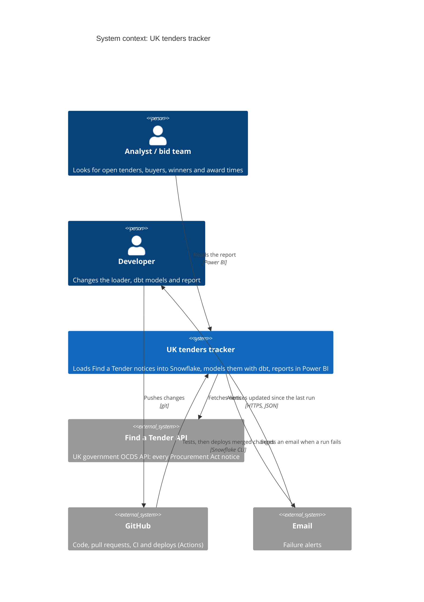

One external data source, one platform (Snowflake) doing all the work, and GitHub as the only way changes reach it ([ADR 0001](adr/0001-run-ingestion-in-snowflake.md), [ADR 0019](adr/0019-deploy-after-ci-checks.md)).

## 2. Containers (C4 level 2)

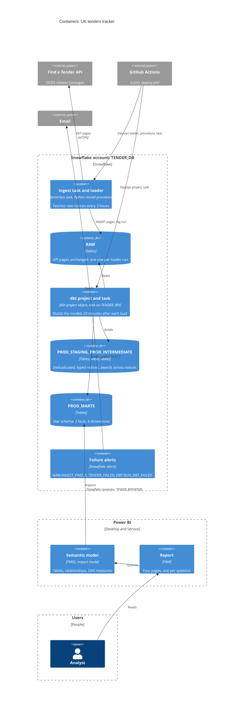

- The loader is plain Python, deployed to a stage and run as a stored procedure, so no server of our own runs anything ([ADR 0001](adr/0001-run-ingestion-in-snowflake.md)).
- dbt runs inside Snowflake as a dbt project object, on a schedule, not triggered by the load ([ADR 0009](adr/0009-run-dbt-on-a-schedule-in-snowflake.md)).
- Power BI reads only `PROD_MARTS`, through a read-only role ([ADR 0023](adr/0023-star-schema-for-power-bi.md), [ADR 0024](adr/0024-prod-schema-prefix.md)).

## 3. dbt project components (C4 level 3)

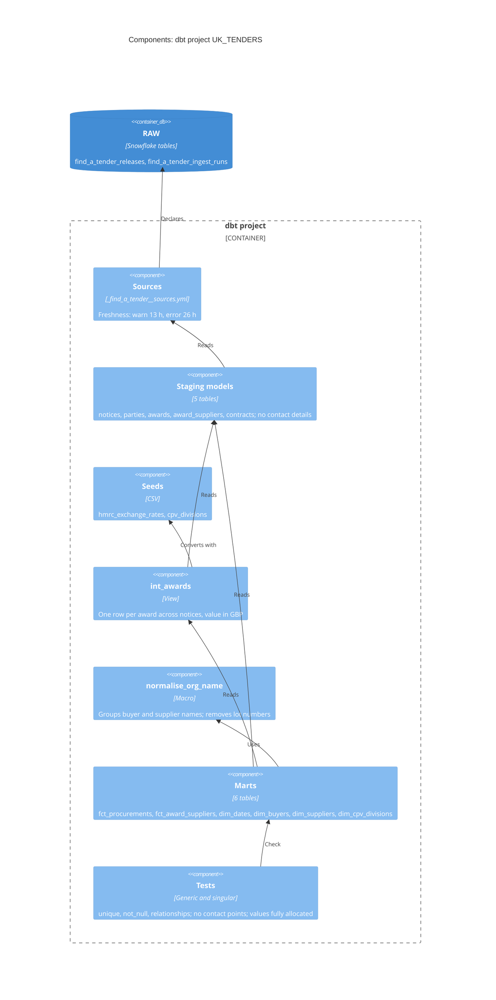

Layers and conventions: [dbt.md](dbt.md). Rules behind the facts: [ADR 0020](adr/0020-convert-amounts-to-gbp-with-hmrc-rates.md) (GBP), [ADR 0021](adr/0021-keep-supplier-names.md) (names), [ADR 0022](adr/0022-award-fact-rules.md) (award fact).

## 4. Deployment (C4)

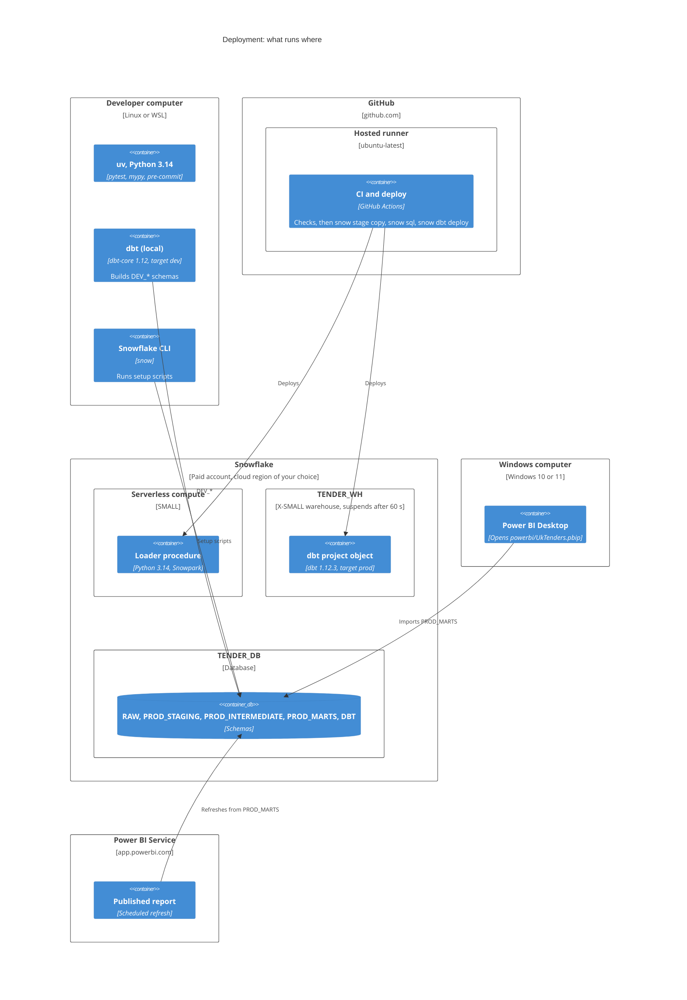

The ingest task is serverless (billed per second of compute); dbt projects can't run serverless, so the dbt task uses `TENDER_WH`. Power BI talks to Snowflake directly from the cloud; no on-premises data gateway is needed.

## 5. Swimlane: from notice to dashboard

```mermaid
flowchart LR
    subgraph L1["Buyer and Find a Tender"]
        A1["Buyer publishes a notice<br/>UK4 tender, UK6 award, ..."] --> A2["API serves it as<br/>an OCDS release"]
    end
    subgraph L2["Ingest task, every 3 h"]
        B1["Fetch releases updated<br/>since the last run"] --> B2["Store each page<br/>unchanged in RAW"]
    end
    subgraph L3["dbt task, 20 min later"]
        C1["Check source<br/>freshness"] --> C2["Staging: deduplicate,<br/>flatten, strip contacts"]
        C2 --> C3["Intermediate: one row<br/>per award, in GBP"] --> C4["Marts: star schema"] --> C5["Tests"]
    end
    subgraph L4["Power BI"]
        D1["Scheduled refresh<br/>imports the marts"] --> D2["Measures and pages"]
    end
    subgraph L5["Analyst"]
        E1["What's open? Who's buying?<br/>Who's winning? How long?"]
    end
    A2 -->|"up to 3 h"| B1
    B2 -->|"20 min"| C1
    C5 -->|"next refresh"| D1
    D2 --> E1
```

A notice reaches the report within about 3½ hours by day, 12 hours overnight, plus the Power BI refresh interval. Lanes are owners: each one only reads what the lane before it wrote.

## 6. Swimlane: from change to production

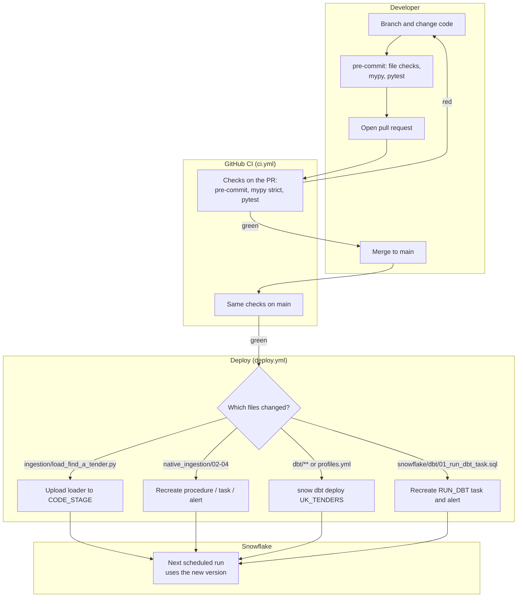

Only objects whose files changed are redeployed ([ADR 0005](adr/0005-deploy-only-changed-objects.md)), and only after the checks pass ([ADR 0019](adr/0019-deploy-after-ci-checks.md)). A manual run, or a change to `deploy.yml` itself, deploys everything. One-off setup that needs ACCOUNTADMIN stays manual.

## 7. Sequence: one ingest run

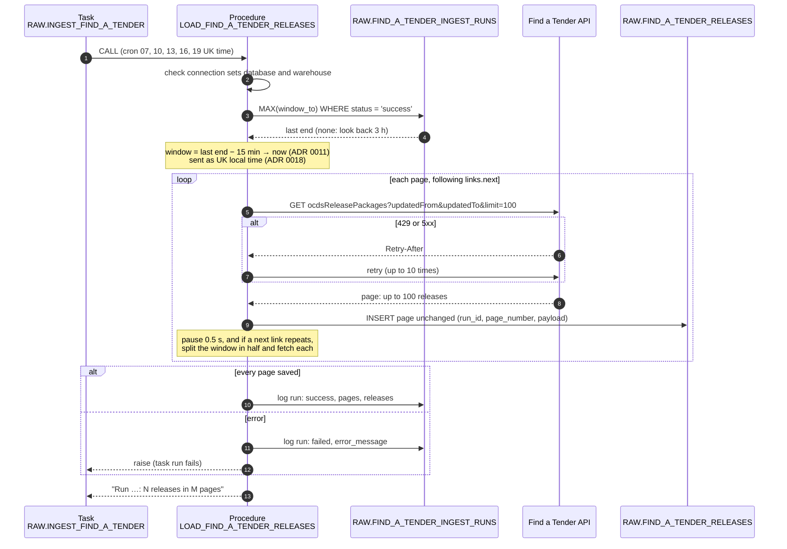

A failed run doesn't move the watermark, so the next run fetches the same window again; duplicates from overlap and retries are removed in staging. Backfill uses the same `load_window`, one UTC day per run ([ADR 0017](adr/0017-backfill-from-procurement-act-start.md)).

## 8. Sequence: scheduled dbt run and failure alerts

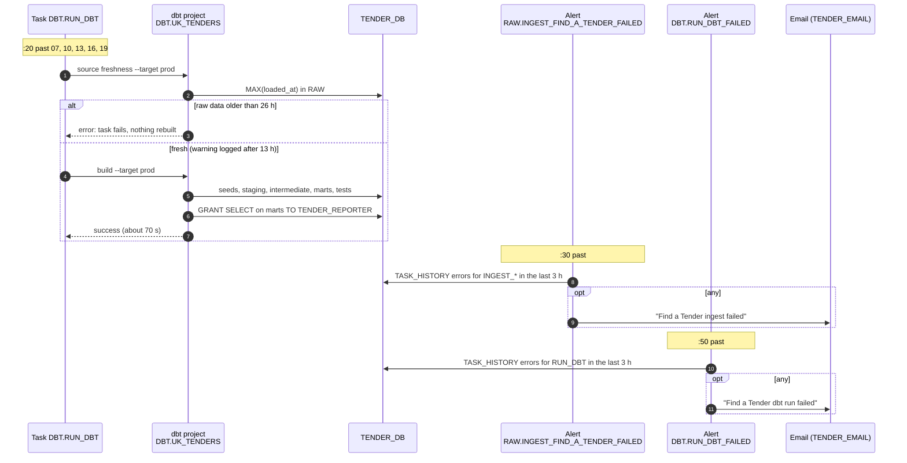

Each check looks back 3 hours, the gap between runs, so a failure is emailed once ([ADR 0003](adr/0003-failure-alert-by-email.md), [ADR 0010](adr/0010-source-freshness-thresholds.md)).

## 9. Daily schedule

One cycle, repeated at 07:00, 10:00, 13:00, 16:00 and 19:00 UK time (Europe/London, so it follows BST) every day ([ADR 0002](adr/0002-one-daily-ingest-schedule.md)). Durations are typical runs in October 2026.

```mermaid
gantt
    title One cycle (starts at 07, 10, 13, 16, 19)
    dateFormat HH:mm:ss
    axisFormat %H:%M

    section Ingest
    Load from API (about 25 s)        :ingest, 07:00:00, 1m
    Ingest failure alert              :milestone, 07:30:00, 0m
    section dbt
    Freshness and build (about 70 s)  :dbt, 07:20:00, 2m
    dbt failure alert                 :milestone, 07:50:00, 0m
    section Power BI
    Scheduled refresh (suggested)     :pbi, 08:00:00, 5m
```

The 20-minute gap leaves room for a slow load (the task times out at 15 minutes). Power BI Service schedules refreshes on the hour or half hour, so 08:00, 11:00, 14:00, 17:00 and 20:00 pick up each build.

## 10. Data layers and grain

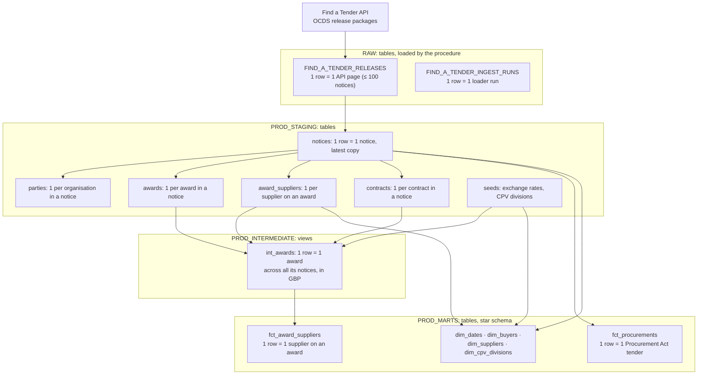

Staging keeps one row per notice, so the same award shows up in several notices; deduplication happens once, in `int_awards`, before anything is summed ([ADR 0015](adr/0015-staging-as-tables.md), [ADR 0012](adr/0012-business-terms-in-staging.md)).

## 11. dbt lineage

Every model, seed and source, as `dbt docs` draws it. Test models are left out.

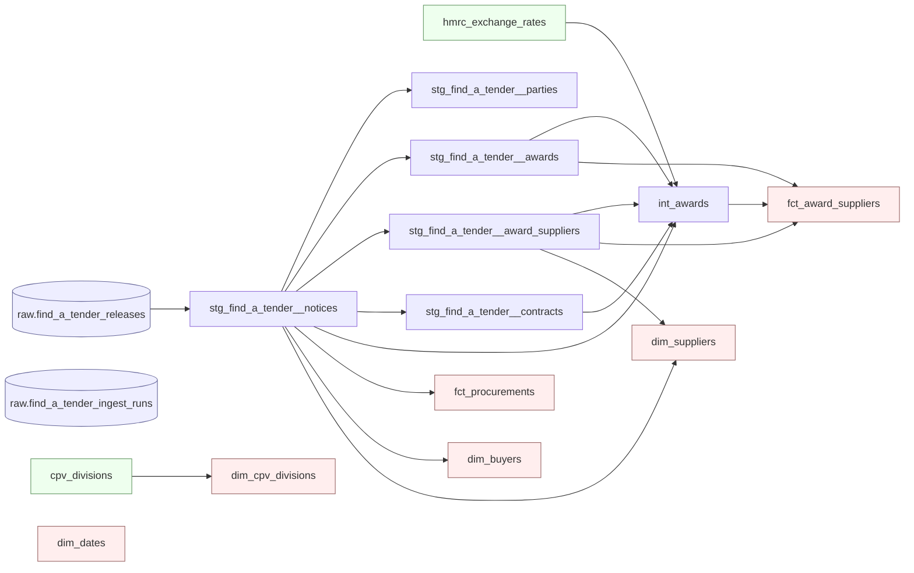

`raw.find_a_tender_ingest_runs` is declared for freshness only; no model reads it. `dim_dates` is generated from project variables, not read from a table.

## 12. Roles and access

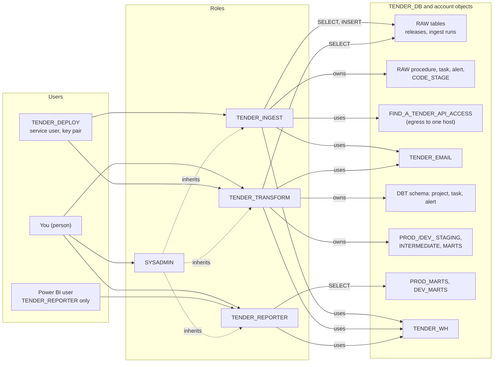

One role per job, each with only what that job needs ([ADR 0004](adr/0004-least-privilege-roles-and-deploy-user.md)). Grants live in `snowflake/setup/03–04`, `snowflake/native_ingestion/01_external_access.sql` and `snowflake/dbt/00_dbt_setup.sql`; mart `SELECT` is re-granted by dbt on every build. Snowflake activates a user's secondary roles too, so the Power BI user should hold `TENDER_REPORTER` and nothing else.

## 13. Task and alert states

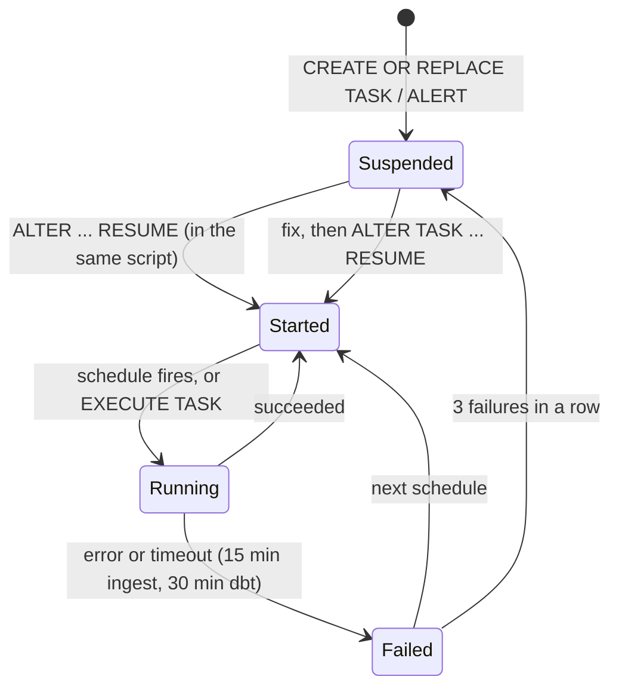

Alerts (`INGEST_FIND_A_TENDER_FAILED`, `RUN_DBT_FAILED`) have only Suspended and Started: each check either sends an email or does nothing. A redeploy recreates a task and resumes it, which also clears a suspension after 3 failures.

## 14. Procurement lifecycle in the model

Which notices fill which columns of `FCT_PROCUREMENTS` (one row per procurement with a UK4 tender) and `FCT_AWARD_SUPPLIERS`. Notice types are explained in the [procurement primer](procurement-primer.md#4-procurement-act-notice-types).

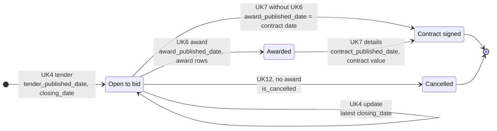

- "Open" is decided in Power BI at query time (closing date from today, no award, not cancelled), so it never goes stale between refreshes.
- `days_tender_to_award` and `days_award_to_contract` are the gaps between these dates.
- Awards without a UK4 (direct awards via UK5, framework call-offs) appear in `FCT_AWARD_SUPPLIERS` but not in `FCT_PROCUREMENTS`.

## Quality gates

| Gate | Where | Stops |
|---|---|---|
| pre-commit: private keys, YAML/TOML, mypy strict, pytest | Each commit, and CI | Broken Python, committed keys |
| CI must pass before deploy | `ci.yml` → `deploy.yml` | Untested code reaching Snowflake |
| Source freshness: warn 13 h, error 26 h | First step of `RUN_DBT` | Rebuilding marts on stale data |
| dbt tests: keys, relationships, singular tests | `dbt build` | Bad rows going unnoticed: a failing test fails the build |
| Failure alerts | `:30` and `:50` past each run | Silent failures |

## Security and privacy

- Buyer contact details are personal data: they stay in `RAW` and are stripped from staging, including the stored JSON; a dbt test enforces it ([ADR 0016](adr/0016-strip-contact-details-in-staging.md)).
- Key-pair login for people and the deploy user; the private key lives in a GitHub secret, never in the repo (pre-commit `detect-private-key`).
- The loader can reach one host only (network rule `FIND_A_TENDER_API_RULE`).
- The data itself is public, under the Open Government Licence v3.0.

## Known gaps

Open items and their priority are in the [DataOps review](plans/dataops-review.md); the README lists what's done and what's next.
