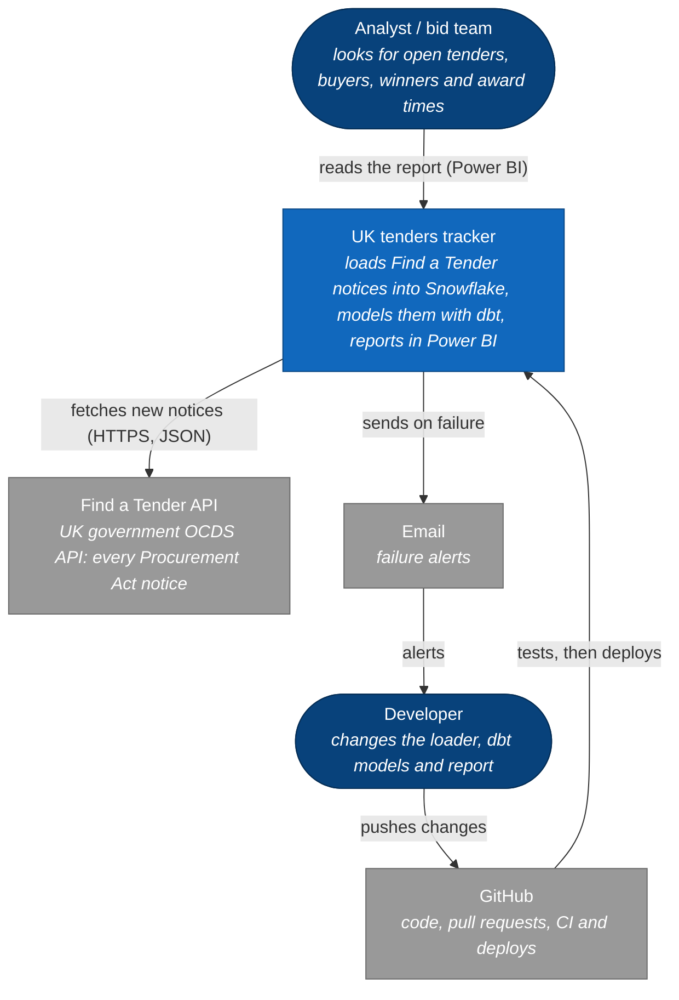
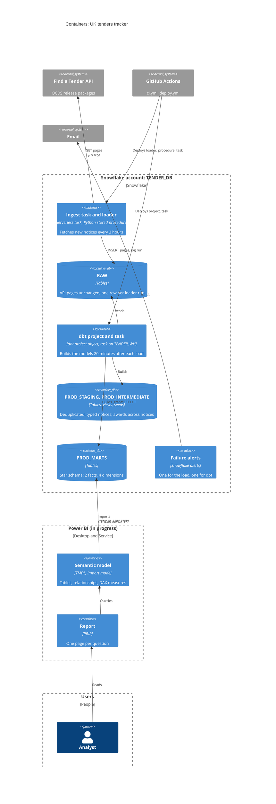
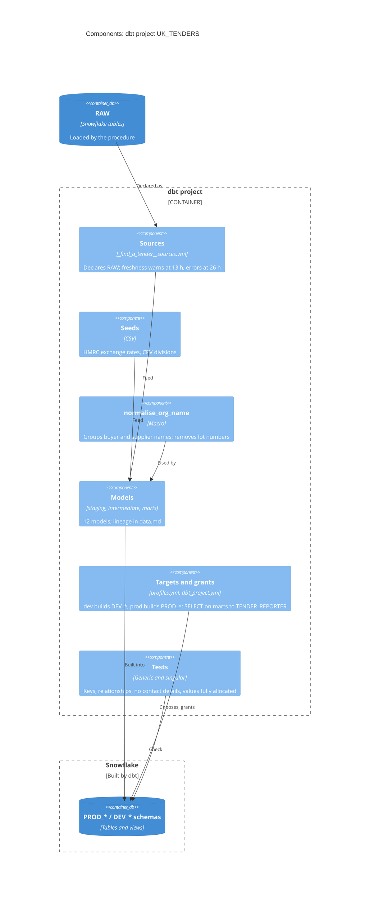
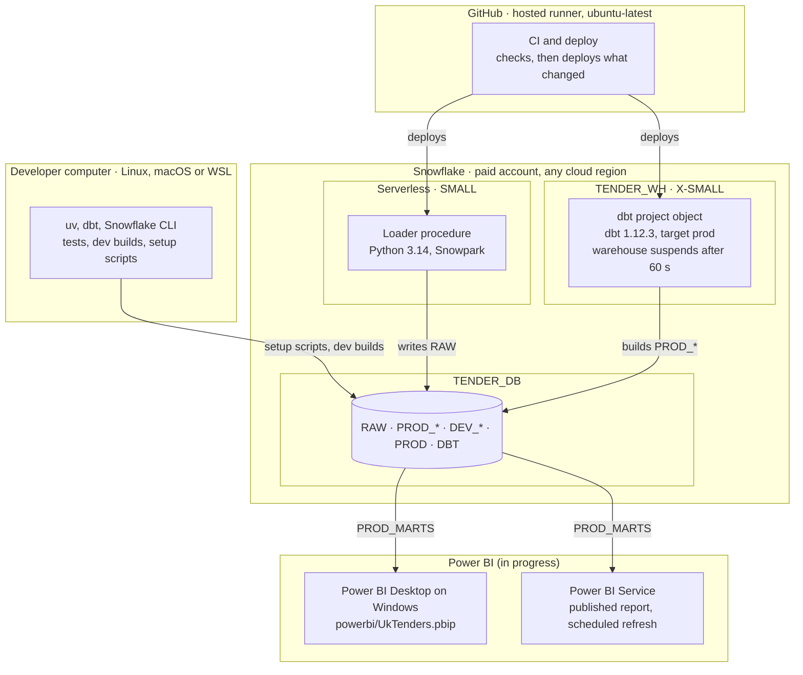

# C4 diagrams

The system at three zoom levels, plus where each part runs, following the [C4 model](https://c4model.com). Dark blue rounded shapes are people, blue boxes are ours, grey boxes are outside the system; arrows point the way data or deployments flow. Two views are drawn as flowcharts, which Mermaid lays out more clearly than its C4 diagrams. Overview: [architecture.md](../architecture.md).

## System context

Who uses the system and what it depends on: one data source, one platform doing all the work, and GitHub as the only way code changes reach it. One-off setup that needs ACCOUNTADMIN is run by hand ([ADR 0001](../adr/0001-run-ingestion-in-snowflake.md), [ADR 0019](../adr/0019-deploy-after-ci-checks.md)).

## Containers

The moving parts inside the system. The loader is plain Python run as a stored procedure, so no server of our own runs anything ([ADR 0001](../adr/0001-run-ingestion-in-snowflake.md)); dbt runs inside Snowflake on its own schedule ([ADR 0009](../adr/0009-run-dbt-on-a-schedule-in-snowflake.md)); Power BI reads only `PROD_MARTS`, through a read-only role ([ADR 0023](../adr/0023-star-schema-for-power-bi.md)). The Power BI report is in progress on branch `feat/powerbi`.

## dbt project components

What the dbt project holds besides the models themselves; which model reads which is in [data.md](data.md#dbt-lineage). Arrows follow the data. Conventions: [dbt.md](../dbt.md).

Rules behind the facts: [ADR 0020](../adr/0020-convert-amounts-to-gbp-with-hmrc-rates.md) (GBP), [ADR 0021](../adr/0021-keep-supplier-names.md) (names), [ADR 0022](../adr/0022-award-fact-rules.md) (award fact).

## Deployment

What runs where, as a C4 deployment view (drawn as a flowchart, which lays out more clearly). Outer boxes are machines or services, inner boxes the compute inside them. The ingest task is serverless (billed per second); dbt projects can't run serverless, so the dbt task uses `TENDER_WH`. Power BI reaches Snowflake directly from the cloud, without a gateway.

`PROD` stays empty: the prod dbt profile needs a schema of its own, and models go to `PROD_<layer>`.
