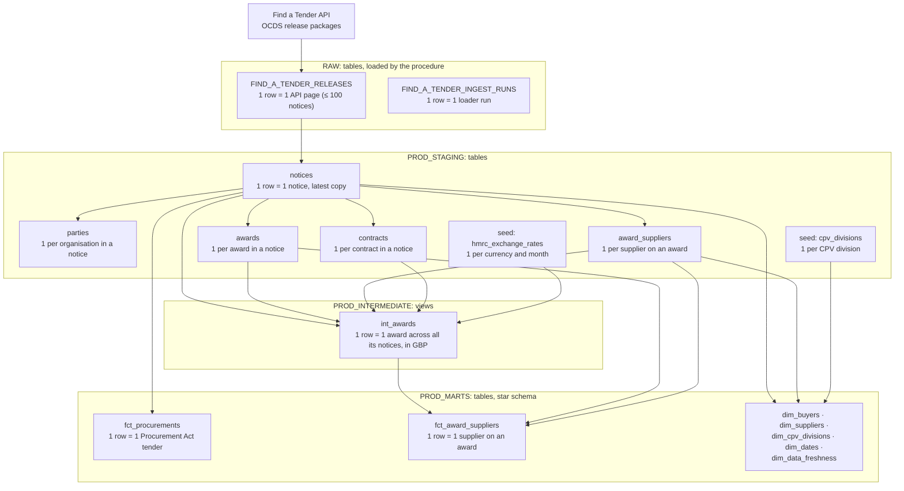
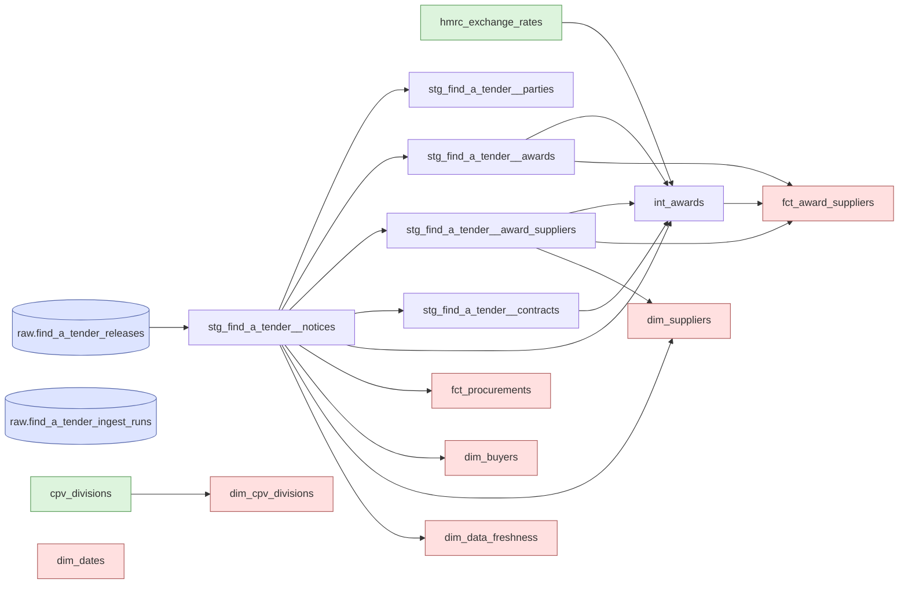

# Data

What one row means at each layer, and which dbt model reads which. Arrows follow the data, from source to mart. Table-level detail: [staging ERD](staging-erd.md), [marts ERD](marts-erd.md). Overview: [architecture.md](../architecture.md).

## Layers and grain

Each box is a table or view with its grain: what one row is. Staging keeps one row per notice, so the same award appears in several notices; `int_awards` deduplicates once, before anything is summed ([ADR 0015](../adr/0015-staging-as-tables.md), [ADR 0012](../adr/0012-business-terms-in-staging.md)).

`FIND_A_TENDER_INGEST_RUNS` feeds the loader's watermark and dbt's freshness check, not the models. `parties` is not read by any mart yet. `dim_dates` is generated from project variables.

## dbt lineage

Every model, seed and source, as `dbt docs` draws it; tests are left out. Colours: blue cylinders are sources, green boxes seeds, white boxes staging and intermediate models, red boxes marts.

`raw.find_a_tender_ingest_runs` is declared for freshness only; no model reads it. `dim_dates` has no inputs.
