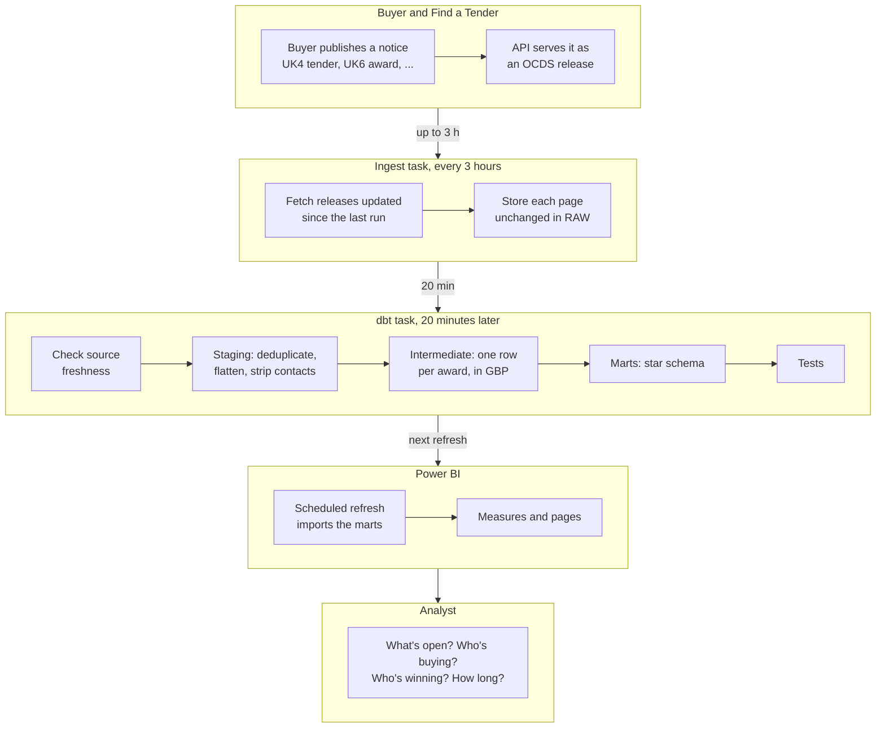
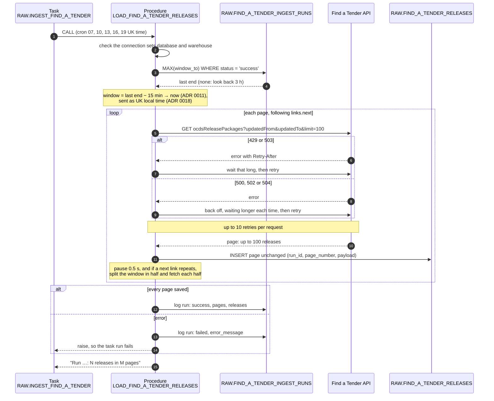
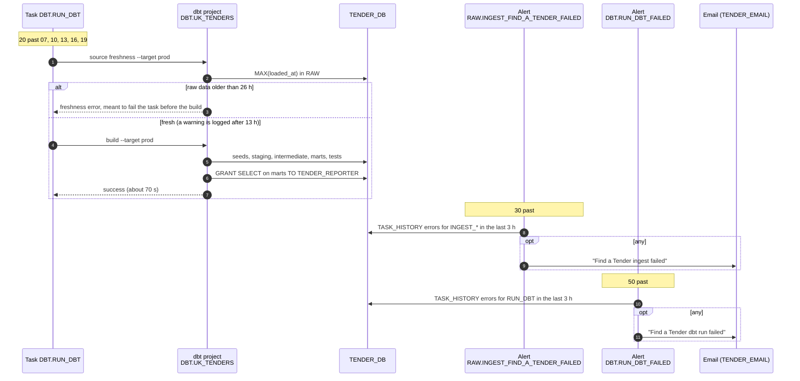
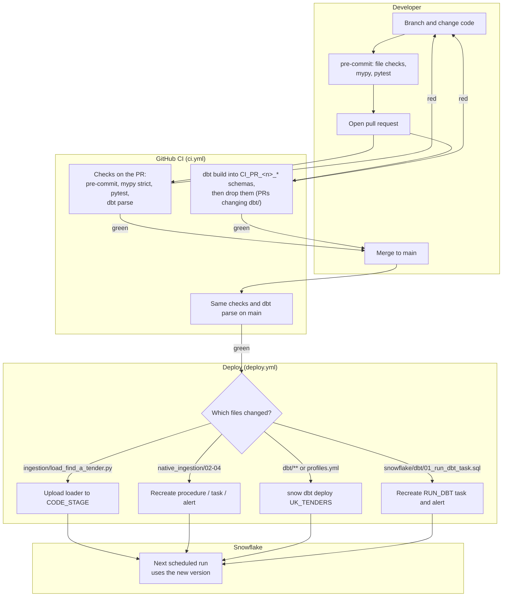

# Flows

How data and changes move through the system, and when. Swimlanes have one box per owner; sequence diagrams read top to bottom, one column per part, with `alt` boxes for either/or paths and `loop` boxes for repeats. Overview: [architecture.md](../architecture.md).

## Notice to dashboard

The data's journey, one lane per owner; each lane only reads what the lane before it wrote. A notice reaches the marts within about 3½ hours by day and 12 hours overnight, and the report at its next refresh.

## Daily schedule

One cycle, repeated at 07:00, 10:00, 13:00, 16:00 and 19:00 UK time (Europe/London, so it follows BST), every day ([ADR 0002](../adr/0002-one-daily-ingest-schedule.md)). Bars are jobs, diamonds are alert checks; durations are typical runs in October 2026.

```mermaid
gantt
    title One cycle (starts at 07, 10, 13, 16, 19)
    dateFormat HH:mm:ss
    axisFormat %H:%M

    section Ingest
    Load from API (about 25 s)        :ingest, 07:00:00, 1m
    Ingest failure alert              :milestone, 07:30:00, 0m
    section dbt
    Freshness and build (about 70 s)  :dbt, 07:20:00, 2m
    dbt failure alert                 :milestone, 07:50:00, 0m
    section Power BI
    Scheduled refresh                 :pbi, 08:00:00, 5m
    Refresh missed alert              :milestone, 09:30:00, 0m
```

The 20-minute gap leaves room for a slow load (the ingest task times out at 15 minutes). Power BI Service schedules refreshes on the hour or half hour, so the refresh is set for 08:00, 11:00, 14:00, 17:00 and 20:00, picking up each build. 90 minutes later a Snowflake alert emails if Power BI didn't read the marts ([ADR 0031](../adr/0031-alert-when-power-bi-stops-refreshing.md)).

## One ingest run

What the loader does in one scheduled run. A failed run doesn't move the watermark, so the next run fetches the same window again; duplicates from the overlap and retries are removed in staging. The backfill uses the same steps, one UTC day per run ([ADR 0017](../adr/0017-backfill-from-procurement-act-start.md)).

## dbt run and failure alerts

How dbt runs after each load, and how a failure of either job reaches you. Each alert looks back 3 hours, the gap between runs, so a failure is emailed once ([ADR 0003](../adr/0003-failure-alert-by-email.md), [ADR 0010](../adr/0010-source-freshness-thresholds.md)).

Whether a freshness error stops the task before the build is still to be confirmed once in Snowflake ([dbt.md → Runs in Snowflake](../dbt.md#runs-in-snowflake)).

## Change to production

How a code change reaches Snowflake, one lane per owner. Only objects whose files changed are redeployed ([ADR 0005](../adr/0005-deploy-only-changed-objects.md)), and only after the checks pass ([ADR 0019](../adr/0019-deploy-after-ci-checks.md)); pull requests that change dbt also build and test it in throwaway schemas ([ADR 0030](../adr/0030-build-dbt-in-ci.md)). A manual run, or a change to `deploy.yml` itself, deploys everything. One-off setup that needs ACCOUNTADMIN stays manual.

