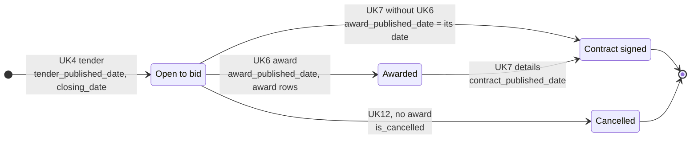
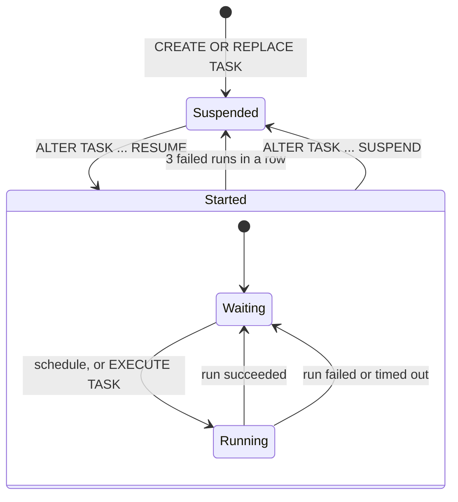

# Lifecycles

How things change state over time: a procurement as its notices arrive, and a scheduled task as it runs and fails. Overview: [architecture.md](../architecture.md).

## Procurement in the model

Boxes are the stages a procurement goes through; each arrow is the notice that moves it on, with the fact columns that notice fills. Covers `FCT_PROCUREMENTS` (one row per procurement with a UK4 tender) and `FCT_AWARD_SUPPLIERS`. Notice types are explained in the [procurement primer](../procurement-primer.md#4-procurement-act-notice-types).

- A later UK4 for the same procurement updates `closing_date`; the latest one wins.
- "Open" is decided in Power BI at query time (closing date from today, no award, not cancelled), so it never goes stale between refreshes.
- `days_tender_to_award` and `days_award_to_contract` are the gaps between these dates; `days_award_to_contract` only when there is a UK6 award notice, so a UK7 without one doesn't count as 0 days.
- A UK7's contract value is used for the award's value only when the award has none (`int_awards`).
- Awards without a UK4 (direct awards through UK5, framework call-offs) appear in `FCT_AWARD_SUPPLIERS` but not in `FCT_PROCUREMENTS`.

## Scheduled tasks

The outer boxes are the task's state, which you change; the inner boxes are its runs while it is started. Applies to `RAW.INGEST_FIND_A_TENDER` and `DBT.RUN_DBT`.

- Timeouts: 15 minutes for the load, 30 minutes for dbt.
- The deploy scripts create each task and resume it straight away, so a redeploy also clears a suspension after 3 failures.
- Alerts (`INGEST_FIND_A_TENDER_FAILED`, `RUN_DBT_FAILED`, `PIPELINE_STALE`, `POWERBI_REFRESH_MISSED`) are only suspended or started; each check either sends an email or does nothing.
