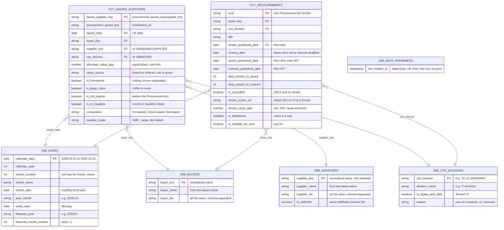

# Marts entity-relationship diagram

The star schema the Power BI report reads ([ADR 0023](../adr/0023-star-schema-for-power-bi.md)). Grows as marts are built; key and defining columns only, details in `dbt docs`. Keep in step with the models (rule in `CLAUDE.md`).

## Reading notes

- `FCT_PROCUREMENTS`: one row per tender. Open = `closing_date` from today, no `award_published_date`, not `is_cancelled`, worked out in Power BI so it never goes stale. Its other dates also join `DIM_DATES`, as inactive relationships.
- `FCT_AWARD_SUPPLIERS`: one row per supplier on an award; sum `allocated_value_gbp`, filtered on `is_in_headline` for headline numbers. Rules in [ADR 0022](../adr/0022-award-fact-rules.md).
- Facts join buyers on `buyer_key` and suppliers on `supplier_key`: the name normalised with the macro `normalise_org_name` (lot numbers, a trailing "(…)", "The", legal suffixes, spaces and punctuation removed, upper case), because one organisation appears under several IDs and spellings ([ADR 0021](../adr/0021-keep-supplier-names.md), [ADR 0026](../adr/0026-looser-organisation-key.md)).
- Facts join their CPV division (`LEFT(cpv_code, 2)`) to `cpv_division`; a notice without a CPV code uses the latest one in the same procurement, and only if none has one joins the "Unknown sector" row (`UNKNOWN`).
- `DIM_DATA_FRESHNESS` has one row and joins nothing: the report shows it as "Last refreshed".
- Facts join their date columns (UK date, not UTC) to `calendar_date`; a fact has several dates, so in Power BI one relationship is active and the others are used with `USERELATIONSHIP`.
