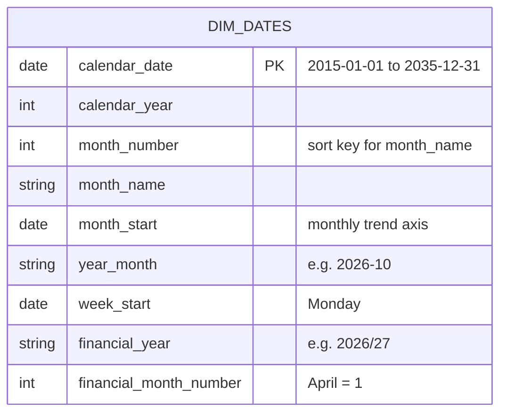

# Marts entity-relationship diagram

The star schema the Power BI report reads ([ADR 0019](../adr/0019-star-schema-for-power-bi.md)). Grows as marts are built; key and defining columns only, details in `dbt docs`. Keep in step with the models (rule in `CLAUDE.md`).

## Reading notes

- Facts join their date columns (UK date, not UTC) to `calendar_date`; a fact has several dates, so in Power BI one relationship is active and the others are used with `USERELATIONSHIP`.
