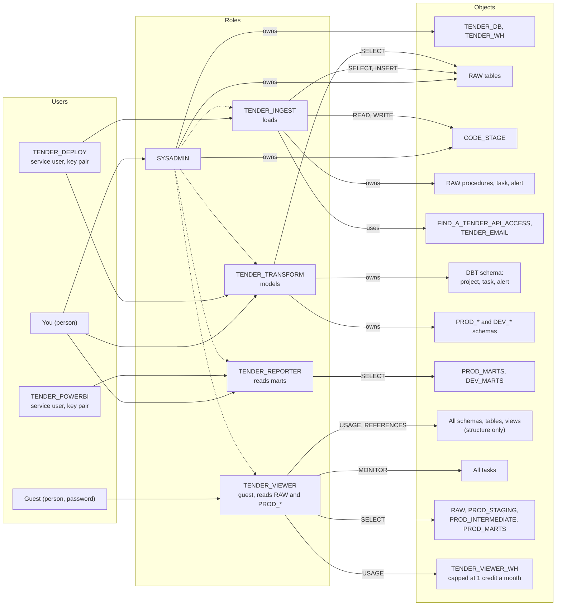

# Security

Who can read or change what. Overview: [architecture.md](../architecture.md).

## Roles and access

Read left to right: users hold roles, roles have privileges on objects. Solid arrows are grants; dotted arrows mean a role inherits another (SYSADMIN can do whatever the other roles can). One role per job, each with only what that job needs ([ADR 0004](../adr/0004-least-privilege-roles-and-deploy-user.md)).

- All three job roles also have `USAGE` on `TENDER_WH`; left out to keep the picture readable.
- `TENDER_VIEWER` is for guests: it browses everything, queries `RAW` and the prod schemas, and runs only on `TENDER_VIEWER_WH`, which a resource monitor caps at 1 credit a month. `PUBLIC`'s default warehouses and compute pools are revoked so they can't be used instead ([ADR 0029](../adr/0029-guest-role-with-capped-warehouse.md)). The guest's user name and password are passed in when the script runs, not committed.
- Grants live in `snowflake/setup/03–05`, `snowflake/native_ingestion/01_external_access.sql` and `snowflake/dbt/00_dbt_setup.sql`; `SELECT` on each mart table is re-granted by dbt on every build.
- The API integration lets the loader reach one host only (network rule `FIND_A_TENDER_API_RULE`).
- Snowflake activates a user's secondary roles too, so the Power BI user holds `TENDER_REPORTER` and nothing else.
- Buyer contact details stay in `RAW`; staging strips them, including from the stored JSON, and a dbt test enforces it ([ADR 0016](../adr/0016-strip-contact-details-in-staging.md)).
