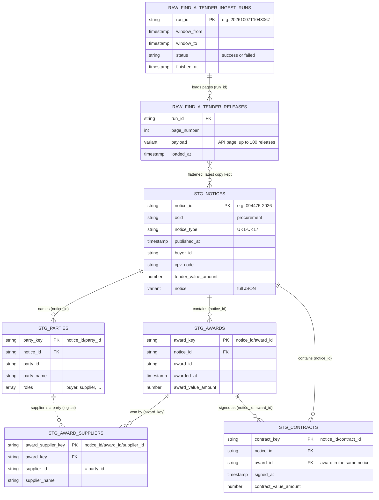

# Staging entity-relationship diagram

Raw tables and the dbt staging models: what one row is, the keys, and how tables relate. Key and defining columns only; every column with its description is in `dbt docs` ([dbt.md](../dbt.md)). Keep this diagram in step with the models (rule in `CLAUDE.md`).

## Reading notes

| Table | One row is |
|---|---|
| `RAW_FIND_A_TENDER_INGEST_RUNS` | a loader run |
| `RAW_FIND_A_TENDER_RELEASES` | an API page (up to 100 releases) |
| `STG_NOTICES` | a notice (= one OCDS release), deduplicated across pages |
| `STG_PARTIES` | an organisation named in a notice |
| `STG_AWARDS` | an award in a notice |
| `STG_AWARD_SUPPLIERS` | a supplier on an award |
| `STG_CONTRACTS` | a contract in a notice |

- Staging tables are named `stg_find_a_tender__<entity>`; the `STG_` names above are shortened.
- **The same award or contract appears in several notices** of one procurement (`ocid`), e.g. a UK6 award and the later UK7 contract details. Staging keeps one row per notice; marts must deduplicate before summing values.
- `STG_PARTIES` to `STG_AWARD_SUPPLIERS` is a logical link (`supplier_id` = `party_id` in the same notice), not enforced by a test.
