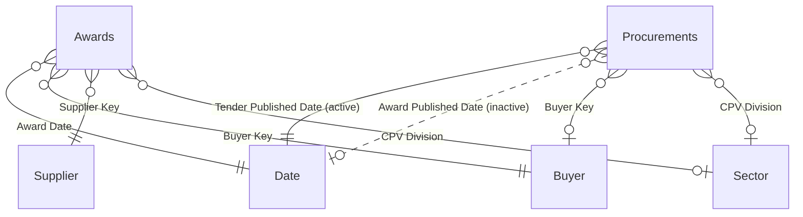

# Power BI report

The report reads the dbt marts in `PROD_MARTS` ([dbt.md](dbt.md#marts)) and is stored as a Power BI Project, so the model and every visual are text files reviewed like code ([ADR 0014](adr/0014-power-bi-project-files.md)). To set it up on your own Snowflake account, start at [Set up your own](#set-up-your-own).

## Layout

| Path | Contents |
|---|---|
| `powerbi/UkTenders.pbip` | Open this in Power BI Desktop |
| `powerbi/UkTenders.SemanticModel/definition/` | Model in TMDL: `expressions.tmdl` (connection parameters), `tables/*.tmdl` (columns, measures), `relationships.tmdl` |
| `powerbi/UkTenders.Report/definition/` | Report in PBIR: `pages/<page>/page.json`, `pages/<page>/visuals/<visual>/visual.json` |
| `powerbi/UkTenders.Report/StaticResources/RegisteredResources/HippoDigital.json` | Theme: colours, fonts, visual defaults |

Not committed (`.gitignore`): `.pbi/cache.abf` (the imported data) and `.pbi/localSettings.json`.

## Pages

One page per question the tracker answers. Every page has the same header, a "data as of" card and Market / Sector / Buyer slicers, synced across pages.

| Page | Cards | Visuals |
|---|---|---|
| What's open to bid? | Open Tenders, Closing in 14 Days | Open tenders, soonest closing first |
| Who's buying? | Awarded Value, Awards (last 12 complete months) | Top buyers; awarded value by month |
| Who's winning? | Top 10 Supplier Share, Suppliers Awarded, Awarded Value | Top suppliers; value by sector; supplier table with market share |
| How long to award? | Median days tender → award, award → contract | Median days by award month; tenders with their durations |

Headline values exclude framework ceilings and awards of £100m or more ([ADR 0022](adr/0022-award-fact-rules.md)).

## Model

Import mode: each table reads one mart table, so the report is fast and Snowflake is only queried at refresh.



| Table | Mart | Measures |
|---|---|---|
| `Awards` | `FCT_AWARD_SUPPLIERS` | Awarded Value, Awards, Suppliers Awarded, Market Share, Top 10 Supplier Share, Framework Ceiling Value, Large Awards |
| `Procurements` | `FCT_PROCUREMENTS` | Tenders, Open Tenders, Closing in 14 Days, Days to Close, Median Days Tender to Award (also by award month, through the inactive relationship), Median Days Award to Contract, Data As Of |
| `Date` | `DIM_DATES` | |
| `Buyer`, `Supplier`, `Sector` | `DIM_BUYERS`, `DIM_SUPPLIERS`, `DIM_CPV_DIVISIONS` | |

"Open" is worked out at query time (closing date from today, no award, not cancelled), so it stays right between refreshes. Relationships are single direction, dimension to fact.

## Set up your own

Assumes the pipeline runs on your account and `PROD_MARTS` has data ([self-hosting.md](self-hosting.md), steps 1–9).


### 1. A Snowflake user for Power BI

Power BI signs in as its own user that holds only `TENDER_REPORTER`, so it can read the marts and nothing else. Use a key pair: the Snowflake connector supports key-pair sign-in for import models, Microsoft Entra SSO works only for DirectQuery, and password sign-in is being phased out ([Microsoft: Snowflake connector](https://learn.microsoft.com/power-query/connectors/snowflake)).

```bash
openssl genrsa 2048 | openssl pkcs8 -topk8 -nocrypt -out ~/.snowflake/powerbi_key.p8
chmod 600 ~/.snowflake/powerbi_key.p8
PUB=$(openssl rsa -in ~/.snowflake/powerbi_key.p8 -pubout | grep -v '^-----' | tr -d '\n')
snow sql -c tender -q "USE ROLE ACCOUNTADMIN;
  CREATE USER IF NOT EXISTS TENDER_POWERBI
    TYPE = SERVICE
    DEFAULT_ROLE = TENDER_REPORTER
    DEFAULT_WAREHOUSE = TENDER_WH
    DEFAULT_NAMESPACE = TENDER_DB.PROD_MARTS
    COMMENT = 'Power BI: reads the marts only';
  GRANT ROLE TENDER_REPORTER TO USER TENDER_POWERBI;
  ALTER USER TENDER_POWERBI SET RSA_PUBLIC_KEY = '$PUB'"
```

Copy `powerbi_key.p8` to the Windows computer (outside the repository). Check the user sees the marts:

```bash
snow sql -x --account <orgname>-<accountname> --user TENDER_POWERBI --authenticator SNOWFLAKE_JWT \
  --private-key-file ~/.snowflake/powerbi_key.p8 --role TENDER_REPORTER --warehouse TENDER_WH \
  -q "SELECT COUNT(*) FROM TENDER_DB.PROD_MARTS.FCT_PROCUREMENTS"
```

### 2. Power BI Desktop

1. Install [Power BI Desktop](https://www.microsoft.com/power-bi/desktop) (Windows, 64-bit, recent version).
2. *File > Options and settings > Options > Preview features*: if listed, enable *Power BI Project (.pbip) save option* and *Store reports using enhanced metadata format (PBIR)*. Recent versions have both on by default.
3. Install the [DM Sans](https://fonts.google.com/specimen/DM+Sans) font (see [Theme](#theme)); without it the report falls back to Segoe UI.

### 3. Open, connect and refresh

1. Open `powerbi/UkTenders.pbip`. From WSL, the path is `\\wsl.localhost\<distro>\home\<you>\...\powerbi\UkTenders.pbip`.
2. *Home > Transform data > Edit parameters*:

   | Parameter | Value |
   |---|---|
   | `SnowflakeServer` | `<orgname>-<accountname>.snowflakecomputing.com` (Snowsight → account menu → View account details) |
   | `SnowflakeWarehouse` | `TENDER_WH` |
   | `SnowflakeRole` | `TENDER_REPORTER` |
   | `SnowflakeDatabase` | `TENDER_DB` |
   | `SnowflakeSchema` | `PROD_MARTS`, or `DEV_MARTS` to try your dbt changes |

3. *Refresh*. When asked to sign in, choose key-pair authentication, enter user `TENDER_POWERBI` and select `powerbi_key.p8`. To change it later: *File > Options and settings > Data source settings*.
4. Check the cards against Snowflake, e.g. Open Tenders:

   ```sql
   SELECT
       COUNT(*) AS open_tenders
   FROM
       TENDER_DB.PROD_MARTS.FCT_PROCUREMENTS
   WHERE
       closing_date >= CURRENT_DATE()
       AND award_published_date IS NULL
       AND NOT is_cancelled
   ```

### 4. Keep your account name out of git

Saving in Desktop writes the parameter values into `expressions.tmdl`. The committed file holds the placeholder `<orgname>-<accountname>`; don't commit your real host. Either undo the file before each commit:

```bash
git checkout -- powerbi/UkTenders.SemanticModel/definition/expressions.tmdl
```

or tell git to ignore your local copy (undo with `--no-skip-worktree` when you need to change the parameters for real):

```bash
git update-index --skip-worktree powerbi/UkTenders.SemanticModel/definition/expressions.tmdl
```

### 5. Publish and schedule a refresh (optional, needs Power BI Pro)

1. *Home > Publish*, pick a workspace.
2. In Power BI Service: workspace → semantic model `UkTenders` → *Settings*.
   - *Data source credentials > Edit credentials*: key-pair authentication, user `TENDER_POWERBI`, upload `powerbi_key.p8`. No gateway: Power BI Service reaches Snowflake directly.
   - *Refresh*: on, time zone *(UTC+00:00) Dublin, Edinburgh, Lisbon, London*, times 08:00, 11:00, 14:00, 17:00, 20:00 (after each dbt build; Pro allows 8 a day). Add a failure notification email.
3. Share the report or publish it as an app. Viewers need Pro too, unless the workspace is on a Fabric capacity.

### Troubleshooting

| Symptom | Cause and fix |
|---|---|
| *Object does not exist* or empty navigator | dbt hasn't built `PROD_MARTS` yet, or the role lacks grants: run `EXECUTE TASK TENDER_DB.DBT.RUN_DBT`; dbt grants `SELECT` to `TENDER_REPORTER` on every build |
| Sees more than the marts | You signed in as your own user, whose secondary roles are active too; use `TENDER_POWERBI` |
| *No active warehouse* | `TENDER_REPORTER` lacks `USAGE` on `TENDER_WH`: re-run `snowflake/setup/04_reporting_role.sql` |
| Key rejected | The public key on the user doesn't match the file: `DESC USER TENDER_POWERBI` and compare `RSA_PUBLIC_KEY_FP` with `openssl rsa -in powerbi_key.p8 -pubout -outform DER \| openssl dgst -sha256 -binary \| openssl enc -base64` |
| Data looks old | Compare *Data as of* with `SELECT MAX(loaded_at) FROM TENDER_DB.RAW.FIND_A_TENDER_RELEASES`; check the task history ([self-hosting.md](self-hosting.md#run-it)) |
| Fonts look different in Service | Power BI Service renders a fixed set of fonts; see [Theme](#theme) |

## Editing as code

- Measures, columns, relationships: edit `tables/*.tmdl` / `relationships.tmdl`. TMDL is indented with tabs.
- Visuals: edit `visual.json`; each starts with a `$schema` URL, so VS Code validates and autocompletes it. Fields are referenced by table and name as shown in the model (e.g. `Awards` / `Awarded Value`).
- Close and reopen the project in Desktop after editing files outside it; Desktop does not watch for changes.
- Changing a mart column means changing its `sourceColumn` in the table's `.tmdl` in the same PR.

## Theme

Colours and font are taken from [hippodigital.co.uk](https://hippodigital.co.uk) (its stylesheet, October 2026).

**Font: DM Sans** (Google Fonts, open licence): a geometric sans with a modern, friendly feel that stays crisp at small sizes. The theme falls back to Segoe UI where DM Sans is not installed. Power BI Service only renders a fixed set of fonts, so the published report shows Segoe UI unless viewers have DM Sans installed; Desktop and PDF exports from Desktop use DM Sans.

| Role | Colour | Hex |
|---|---|---|
| Ink, headers, first series | Navy | `#0C2340` |
| Accent (header subtitle, card bar, table accent) | Pink | `#E07FA3` |
| Series 2–4 | Pink, light blue, teal | `#E07FA3`, `#A5D0FF`, `#4F9B8D` |
| Series 5–8 (avoid if possible) | Dark pink, mid blue, mint, dark green | `#B8577B`, `#6699CC`, `#A0F5E7`, `#002F26` |
| Secondary text | Slate (navy tint) | `#4B5B70` |
| Page background | Hippo light grey | `#EFF2F2` |
| Visual background / border | White / Hippo grey | `#FFFFFF` / `#DDE4E6` |
| Good / neutral / bad | Teal / yellow / dark pink | `#4F9B8D` / `#FFC42E` / `#B8577B` |

What keeps it from looking generic: a navy header band with a pink subtitle, light grey canvas with white rounded cards, navy single-colour bars (one colour per chart unless the colour means something), and a pink accent bar on KPI cards.

Checked with a colour-vision validator: the first four series (navy, pink, light blue, teal) stay distinguishable for colour-blind readers in that order; beyond four they don't, so split the chart or group into "Other". Pink and light blue are low contrast on white (2.6:1, 1.6:1): keep data labels on, never use them for text. `#B8577B` on white is 4.48:1, just under the 4.5:1 text minimum, so small text uses navy or slate.
