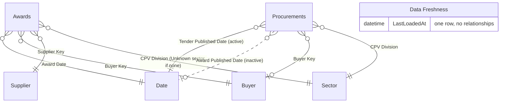
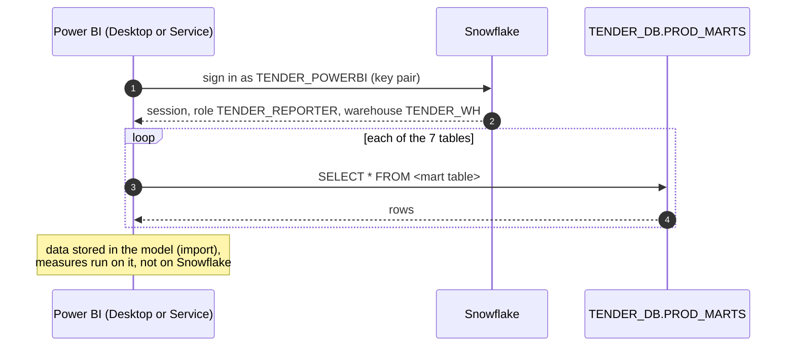

# Power BI report

The report reads the dbt marts in `PROD_MARTS` ([dbt.md](dbt.md#marts)) and is stored as a Power BI Project, so the model and every visual are text files reviewed like code ([ADR 0014](adr/0014-power-bi-project-files.md)). To set it up on your own Snowflake account, start at [Set up your own](#set-up-your-own).

## Layout

| Path | Contents |
|---|---|
| `powerbi/UkTenders.pbip` | Open this in Power BI Desktop |
| `powerbi/UkTenders.SemanticModel/definition/` | Model in TMDL: `expressions.tmdl` (connection parameters), `tables/*.tmdl` (columns, measures), `relationships.tmdl` |
| `powerbi/UkTenders.Report/definition/` | Report in PBIR: `pages/<page>/page.json`, `pages/<page>/visuals/<visual>/visual.json` |
| `powerbi/UkTenders.Report/StaticResources/RegisteredResources/UkTenders.json` | Theme: colours, fonts, visual defaults |

Not committed (`.gitignore`): `.pbi/cache.abf` (the imported data) and `.pbi/localSettings.json`.

## Pages

A landing page, *Home*, explains why the report exists, the time horizon (from 24 February 2025, when the Procurement Act 2023 came in) and the four questions, each a tile with a live number and a button with a specific call to action ("Browse open tenders →"); only the button is clickable, and it alone turns pink on hover. Then one page per question; the pages can be read in any order, and a *Navigate to* dropdown with a *Go →* button in each header opens any page (the `Navigation` table, not linked to the model; the button's destination is the measure `Navigate To`, so it stays disabled until a page is chosen). Slicer cards have a two-line label (name, then a grey hint); the Sector and Buyer slicers have a search box ("Type to search"). Every page has the same header with the time of the latest load ("Data as of", UK time; Power BI imports it about an hour later); question pages have Market / Sector / Buyer slicers, synced across pages. Each page's Buyer list shows only buyers with something on that page (open tenders, headline awards or tenders awarded); names starting with a digit sort last (`Buyer Sort`). Every page has a footnote ("Please note:") in the same 48 px box at the bottom, saying what it covers and leaves out. On Who's buying?, Who's winning? and How long to award? it is live and names the months the page covers (e.g. "Oct 2025 to Sep 2026"); on the first two it also counts, under the current filters, what the totals leave out: frameworks and other multi-supplier awards, awards of £100m or more, awards from procurements begun before 24 Feb 2025, and awards with no value, each award counted once (measures `Exclusions Note` and `Timing Note`, shown as the text of a button with no action, the way to put a measure into a line of text). The supplier league table says in its subtitle that it names suppliers only. Dropdowns, text, buttons and cards hide their hover icons (filter, focus mode, …), and every visual keeps its layer when clicked, so the header bar never covers the Navigate dropdown and a footer's box never covers its text; Publish to web can take about an hour to show such changes. Who's buying?, Who's winning? and How long to award? are filtered to the last 12 complete months (a page filter on `Date`), so a part-month never drags a trend down.

| Page | Cards | Visuals |
|---|---|---|
| Home | Open tenders, contract value awarded, share of suppliers that won only once, median days tender to award (one per question) | Why this report; time horizon; buttons to the four pages |
| What's open to bid? | All Open Tenders; Closing Soon (the slicer's window, 14 days by default, with a matching label); New This Week (first published in the last 7 days) | "Closes within" slicer (today, 7, 14, 30 days, any time; table `Closing Window`) and "Suitable for SMEs" (a tick box, "SME-friendly only": any lot marked suitable); open tenders with closing date, "Closes in" (Today, 1 day, n days), estimated value incl. VAT (frameworks shown as "£… (cap)", never totalled; [ADR 0035](adr/0035-bidder-fields.md)) and a link to the notice on Find a Tender, soonest first |
| Who's buying? | Contract value awarded, Awards, Awarded by the top 10 buyers | Top 10 buyers and top 10 sectors by contract value awarded, both in market colours (see below): who buys, and what they buy |
| Who's winning? | Top 10 Supplier Share, Suppliers Awarded, SME Award Share (with a live label giving the SMEs' share of value) | "How awarded" slicer (Competed, Direct award, Not stated; [ADR 0035](adr/0035-bidder-fields.md)); supplier league table with market share, named suppliers only (no "Unknown supplier", no withheld names), so the shares add up to 100%; "How often suppliers win vs their share of awarded value": for each group (won once, 2–4, 5–9, 10 or more times; table `Win Band`) a pink bar for its share of suppliers and a navy bar for its share of awarded value, each labelled with what it is ("68% of suppliers", "30% of awarded value"), with a legend, and the key numbers in a live subtitle (measure `Win Chart Story`) |
| How long to award? | Median days tender → award, award → contract (awards at least 3 months old, since newer ones often have no contract notice yet), Tenders Awarded; slicers "Award months" (a range within the page's 12 months) and "Stage" (tender to award, or award to contract) | "How long tenders wait for an award" (or "How long from award to contract"): the share of tenders in each wait band (table `Wait Band`), in market colours; a table of each tender's wait for the chosen stage, longest first, with data bars. Click a bar in the chart and the table lists just the tenders in that band and market group |

Headline values exclude framework ceilings, single awards of £100m or more and awards under the old rules ([ADR 0022](adr/0022-award-fact-rules.md), [ADR 0034](adr/0034-award-data-corrections.md)); frameworks are not shown at all, as their ceilings are not spend. Each award in the footnote counts once: frameworks first, then large awards, then the old rules.

**Today in Power BI Service:** `TODAY()` runs in UTC there, so between midnight and 01:00 in summer (BST) "Closes today" and the open-tender count still go by the previous day.

**Market colours** ([ADR 0028](adr/0028-report-navigation-and-market-colours.md)): with no Market, Sector or Buyer chosen, charts show Digital and data (pink) against Other markets (navy); once one is chosen, one colour per market, with a legend of only the markets shown. Charts group by hidden copies of the names (`Buyer Name`, `Sector Name`) and run their Top N on key columns, so their own bars never count as a choice.

## Model

Import mode: each table reads one mart table, so the report is fast and Snowflake is only queried at refresh. Business rules (deduplication, GBP values, headline flags, durations) live in dbt; DAX only adds up, counts and filters, so the numbers can be checked with plain SQL on the marts.



| Table | Mart | Measures |
|---|---|---|
| `Awards` | `FCT_AWARD_SUPPLIERS` | Awarded Value, Awards, Top 10 Buyer Share, SME Award Share, SME Value Share, SME Card Label, Suppliers Awarded and Market Share (both named suppliers only), Top 10 Supplier Share, Framework Ceiling Value, Large Awards, Awarded Value by Group, Suppliers in Win Band, Share of Suppliers in Win Band, Share of Value in Win Band, Win Chart Story (folder *Win bands*); folder *Not in totals*: Framework Awards, Large Award Value, Old Regime Awards, Old Regime Value, No Value Awards, Exclusions Note |
| `Procurements` | `FCT_PROCUREMENTS` | Tenders, Open Tenders, Tender Value, New This Week, All Open Tenders, Closing Soon (+ Label), Days to Close, Median Days Tender to Award, Median Days Award to Contract, Tenders Awarded, Timing Note, Days for Stage, Tenders Timed, Tenders in Wait Band, Share in Wait Band (+ by Group), Days in Chosen Band, Wait Chart Title, Wait Table Title |
| `Date` | `DIM_DATES` | |
| `Buyer`, `Supplier`, `Sector` | `DIM_BUYERS`, `DIM_SUPPLIERS`, `DIM_CPV_DIVISIONS` | (hidden helper columns: Buyer Sort, Buyer Name, Sector Name) |
| `Data Freshness` | `DIM_DATA_FRESHNESS` | Data Loaded |
| `Navigation` | calculated in DAX (5 pages) | Navigate To |
| `Closing Window` | calculated in DAX (5 windows) | Window Days (hidden; used by Open Tenders) |
| `Colour Group` | calculated in DAX (markets + Other markets) | legend groups for the "… by Group" measures |
| `Wait Band`, `Win Band` | calculated in DAX (5 and 4 bands) | axes of the two distribution charts; not linked to the model |
| `Stage` | calculated in DAX (2 stages) | the Stage slicer on How long to award?; not linked to the model |

"Open" is worked out at query time (closing date from today, no award, not cancelled), so it stays right between refreshes. Timing measures (medians, Tenders Awarded) date procurements by award, through the inactive Award Published Date relationship (`USERELATIONSHIP`); everything else uses the tender date. Relationships are single direction, dimension to fact.

## Set up your own

Assumes the pipeline runs on your account and `PROD_MARTS` has data ([self-hosting.md](self-hosting.md), steps 1–9).



### 1. A Snowflake user for Power BI

Power BI signs in as its own user that holds only `TENDER_REPORTER`, so it can read the marts and nothing else. Use a key pair: the Snowflake connector supports key-pair sign-in for import models, Microsoft Entra SSO works only for DirectQuery, and password sign-in is being phased out ([Microsoft: Snowflake connector](https://learn.microsoft.com/power-query/connectors/snowflake)).

```bash
openssl genrsa 2048 | openssl pkcs8 -topk8 -nocrypt -out ~/.snowflake/powerbi_key.p8
chmod 600 ~/.snowflake/powerbi_key.p8
PUB=$(openssl rsa -in ~/.snowflake/powerbi_key.p8 -pubout | grep -v '^-----' | tr -d '\n')
snow sql -c tender -q "USE ROLE ACCOUNTADMIN;
  CREATE USER IF NOT EXISTS TENDER_POWERBI
    TYPE = SERVICE
    DEFAULT_ROLE = TENDER_REPORTER
    DEFAULT_WAREHOUSE = TENDER_WH
    DEFAULT_NAMESPACE = TENDER_DB.PROD_MARTS
    COMMENT = 'Power BI: reads the marts only';
  GRANT ROLE TENDER_REPORTER TO USER TENDER_POWERBI;
  ALTER USER TENDER_POWERBI SET RSA_PUBLIC_KEY = '$PUB'"
```

Copy `powerbi_key.p8` to the Windows computer (outside the repository). Check the user sees the marts:

```bash
snow sql -x --account <orgname>-<accountname> --user TENDER_POWERBI --authenticator SNOWFLAKE_JWT \
  --private-key-file ~/.snowflake/powerbi_key.p8 --role TENDER_REPORTER --warehouse TENDER_WH \
  -q "SELECT COUNT(*) FROM TENDER_DB.PROD_MARTS.FCT_PROCUREMENTS"
```

### 2. Power BI Desktop

1. Install [Power BI Desktop](https://www.microsoft.com/power-bi/desktop) (Windows, 64-bit, recent version).
2. *File > Options and settings > Options > Preview features*: if listed, enable *Power BI Project (.pbip) save option* and *Store reports using enhanced metadata format (PBIR)*. Recent versions have both on by default.
3. Install the [DM Sans](https://fonts.google.com/specimen/DM+Sans) font (see [Theme](#theme)); without it the report falls back to Segoe UI.

### 3. Open, connect and refresh

1. Open `powerbi/UkTenders.pbip`. From WSL, the path is `\\wsl.localhost\<distro>\home\<you>\...\powerbi\UkTenders.pbip`.
2. *Home > Transform data > Edit parameters*:

   | Parameter | Value |
   |---|---|
   | `SnowflakeServer` | `<orgname>-<accountname>.snowflakecomputing.com` (Snowsight → account menu → View account details) |
   | `SnowflakeWarehouse` | `TENDER_WH` |
   | `SnowflakeRole` | `TENDER_REPORTER` |
   | `SnowflakeDatabase` | `TENDER_DB` |
   | `SnowflakeSchema` | `PROD_MARTS`, or `DEV_MARTS` to try your dbt changes |

3. *Refresh*. When asked to sign in, choose key-pair authentication, enter user `TENDER_POWERBI` and select `powerbi_key.p8`. To change it later: *File > Options and settings > Data source settings*.
4. Check the cards against Snowflake, e.g. Open Tenders:

   ```sql
   SELECT
       COUNT(*) AS open_tenders
   FROM
       TENDER_DB.PROD_MARTS.FCT_PROCUREMENTS
   WHERE
       closing_date >= CURRENT_DATE()
       AND award_published_date IS NULL
       AND NOT is_cancelled
   ```

### 4. Keep your account name out of git

Saving in Desktop writes the parameter values into `expressions.tmdl`. The committed file holds the placeholder `<orgname>-<accountname>`; don't commit your real host. Either undo the file before each commit:

```bash
git checkout -- powerbi/UkTenders.SemanticModel/definition/expressions.tmdl
```

or tell git to ignore your local copy (undo with `--no-skip-worktree` when you need to change the parameters for real):

```bash
git update-index --skip-worktree powerbi/UkTenders.SemanticModel/definition/expressions.tmdl
```

### 5. Publish and schedule a refresh (optional, needs Power BI Pro)

1. *Home > Publish*, pick a workspace.
2. In Power BI Service: workspace → semantic model `UkTenders` → *Settings*.
   - *Data source credentials > Edit credentials*: key-pair authentication, user `TENDER_POWERBI`, upload `powerbi_key.p8`. No gateway: Power BI Service reaches Snowflake directly.
   - *Refresh*: on, time zone *(UTC+00:00) Dublin, Edinburgh, Lisbon, London*, times 08:00, 11:00, 14:00, 17:00, 20:00 (after each dbt build; Pro allows 8 a day). Power BI only emails failures to addresses in its own tenant, so the Snowflake alert `POWERBI_REFRESH_MISSED` emails the alert recipient when a scheduled refresh doesn't read the marts ([ADR 0031](adr/0031-alert-when-power-bi-stops-refreshing.md)).
3. Share the report or publish it as an app. Viewers need Pro too, unless the workspace is on a Fabric capacity.

### Troubleshooting

| Symptom | Cause and fix |
|---|---|
| *Object does not exist* or empty navigator | dbt hasn't built `PROD_MARTS` yet, or the role lacks grants: run `EXECUTE TASK TENDER_DB.DBT.RUN_DBT`; dbt grants `SELECT` to `TENDER_REPORTER` on every build |
| Sees more than the marts | You signed in as your own user, whose secondary roles are active too; use `TENDER_POWERBI` |
| *No active warehouse* | `TENDER_REPORTER` lacks `USAGE` on `TENDER_WH`: re-run `snowflake/setup/04_reporting_role.sql` |
| Key rejected | The public key on the user doesn't match the file: `DESC USER TENDER_POWERBI` and compare `RSA_PUBLIC_KEY_FP` with `openssl rsa -in powerbi_key.p8 -pubout -outform DER \| openssl dgst -sha256 -binary \| openssl enc -base64` |
| Data looks old | Compare *Data loaded* with `SELECT MAX(loaded_at) FROM TENDER_DB.RAW.FIND_A_TENDER_RELEASES`; check the task history ([self-hosting.md](self-hosting.md#run-it)) |
| Fonts look different in Service | Power BI Service renders a fixed set of fonts; see [Theme](#theme) |

## Editing as code

- Measures, columns, relationships: edit `tables/*.tmdl` / `relationships.tmdl`. TMDL is indented with tabs.
- Visuals: edit `visual.json`; each starts with a `$schema` URL, so VS Code validates and autocompletes it. Fields are referenced by table and name as shown in the model (e.g. `Awards` / `Awarded Value`).
- Close and reopen the project in Desktop after editing files outside it; Desktop does not watch for changes.
- Changing a mart column means changing its `sourceColumn` in the table's `.tmdl` in the same PR.

## Theme

A navy and pink palette on a light grey canvas, made for this report.

**Font: DM Sans** (Google Fonts, open licence): a geometric sans with a modern, friendly feel that stays crisp at small sizes. The theme falls back to Segoe UI where DM Sans is not installed. Power BI Service only renders a fixed set of fonts, so the published report shows Segoe UI unless viewers have DM Sans installed; Desktop and PDF exports from Desktop use DM Sans.

| Role | Colour | Hex |
|---|---|---|
| Ink, headers, first series | Navy | `#0C2340` |
| Accent (header subtitle, card bar, table accent) | Pink | `#E07FA3` |
| Series 2–4 | Pink, light blue, teal | `#E07FA3`, `#A5D0FF`, `#4F9B8D` |
| Series 5–8 (avoid if possible) | Dark pink, mid blue, mint, dark green | `#B8577B`, `#6699CC`, `#A0F5E7`, `#002F26` |
| Secondary text | Slate (navy tint) | `#4B5B70` |
| Page background | Light grey | `#EFF2F2` |
| Visual background / border | White / grey | `#FFFFFF` / `#DDE4E6` |
| Good / neutral / bad | Teal / yellow / dark pink | `#4F9B8D` / `#FFC42E` / `#B8577B` |

What keeps it from looking generic: a navy header band with a pink subtitle, light grey canvas with white rounded cards, navy single-colour bars (one colour per chart unless the colour means something), and a pink accent bar on KPI cards.

Checked with a colour-vision validator: the first four series (navy, pink, light blue, teal) stay distinguishable for colour-blind readers in that order; beyond four they don't, so split the chart or group into "Other". Pink and light blue are low contrast on white (2.6:1, 1.6:1): keep data labels on, never use them for text. `#B8577B` on white is 4.48:1, just under the 4.5:1 text minimum, so small text uses navy or slate.
