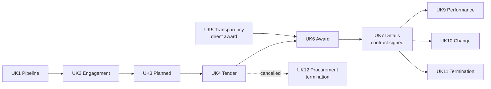

# UK public procurement primer

Background for this project: what public procurement is, how the Procurement Act 2023 structures it into notices, and why the Find a Tender API is the data source. For the API itself, see the [cheatsheet](find-a-tender-api/cheatsheet.md).

## 1. Public procurement

Public procurement is how public bodies (central government departments, councils, NHS trusts, universities, police forces and others) buy goods, services and works from outside suppliers. The UK public sector spends roughly a third of its total budget this way, so it is one of the largest markets in the country.

Because it is public money, buyers usually cannot simply choose a supplier. The law requires a fair and transparent process, and it requires buyers to publish what they are doing at each stage.

## 2. Tenders

A **tender** has two meanings:

- the **competition** a buyer runs to choose a supplier, and
- the **bid** a supplier submits to that competition.

A typical competition:

1. The buyer publishes what it needs, the rules of the competition and how bids will be scored.
2. Suppliers submit bids (tenders) describing how they would do the work and at what price.
3. The buyer scores the bids against the criteria it published in advance.
4. The buyer announces the winner, waits a short standstill period in which losing bidders can challenge, then signs the contract.

Related terms:

| Term | Meaning |
|---|---|
| Buyer / contracting authority | The public body running the procurement |
| Supplier | The company bidding for or delivering the contract |
| Lot | A separately awarded part of a larger procurement |
| Framework | A pre-approved list of suppliers that buyers can award contracts from without running a full competition each time. Much digital and data work is bought this way |
| Direct award | Awarding a contract without competition, allowed only in specific cases and announced in advance |
| Dynamic market | A list of qualified suppliers that stays open for new suppliers to join (replaces the older dynamic purchasing system) |
| Threshold | Contract value above which the full rules apply; thresholds are set in regulations and reviewed periodically |
| CPV code | Common Procurement Vocabulary: a standard code for what is being bought, used to find digital and data work |

## 3. The Procurement Act 2023

The Procurement Act 2023 replaced the previous EU-derived regulations (Public Contracts Regulations 2015 and others) and went live on **24 February 2025**. Its main changes:

- **One rulebook** for most public buyers, with simpler procedures (the open procedure and a flexible "competitive flexible procedure").
- **Much more transparency:** buyers publish a notice at every stage of a procurement's life, from planning to contract end, including performance and payments.
- **One publication point:** all notices are published on **Find a Tender**, the government's central digital platform.

Procurements started before 24 February 2025 continue under the old rules, so both regimes appear in the data for years to come.

## 4. Procurement Act notice types

There are 17 notice types. Each marks a stage in a procurement's life.

| Notice | Name | Published when | Phase |
|---|---|---|---|
| UK1 | Pipeline | Each year (1 April to 26 May) for planned contracts over £2 million in the next 18 months; required for buyers spending over £100 million a year | Plan |
| UK2 | Preliminary market engagement | Before the tender, if the buyer talks to the market first | Plan |
| UK3 | Planned procurement | Early warning of a competition; can shorten tender deadlines | Plan |
| UK4 | Tender | The competition opens: deadlines, procedure, criteria | Procure |
| UK5 | Transparency | Before a direct award (instead of UK4) | Procure |
| UK6 | Contract award | After the award decision, before signing; starts the standstill period | Procure |
| UK7 | Contract details | Within 30 days of signing; contract documents attached for contracts over £5 million | Procure |
| UK8 | Contract payment | Payments over £30,000 under a public contract, reported quarterly | Manage |
| UK9 | Contract performance | KPI results for contracts over £5 million, at least yearly, and on breach or poor performance | Manage |
| UK10 | Contract change | Before changing a contract's value or term | Manage |
| UK11 | Contract termination | Within 30 days of a contract ending, including normal completion | Manage |
| UK12 | Procurement termination | A procurement is cancelled and no contract will be signed | Procure |
| UK13 | Dynamic market intention | Before a dynamic market opens, inviting suppliers to apply | Plan |
| UK14 | Dynamic market establishment | A dynamic market is ready for buyers to use | Procure |
| UK15 | Dynamic market modification | Suppliers added or removed from a dynamic market | Manage |
| UK16 | Dynamic market cessation | A dynamic market stops operating | Manage |
| UK17 | Payments compliance | Every six months: how promptly the buyer paid its suppliers | Manage |

### Typical sequences

- **Competitive:** UK1/UK2/UK3 (optional) → UK4 → UK6 → UK7 → UK9/UK10 → UK11.
- **Direct award:** UK5 → UK6 → UK7 → …
- **Call-off from a framework:** starts at UK6 with no UK4, so the tender date is missing. The data model must allow for this.
- **Cancelled:** UK4 → UK12.

### What this project uses

| Notice | Used for |
|---|---|
| UK1 | Forward-looking demand |
| UK4 | Open opportunities, "closing soon" view, tender date |
| UK5 | Direct awards |
| UK6 | Award date, winning suppliers |
| UK7 | Signed date, contract value |
| UK9, UK8, UK17 | Future work (performance and payment analysis) |

### Old-regime notices

Notices under the earlier regulations use form codes instead, for example F01 (prior information), F02 (contract notice, i.e. tender) and F03 (contract award) under the Public Contracts Regulations 2015. They map poorly to the new stages, so this project's lifecycle model covers Procurement Act notices only and keeps older notices for award analysis.

## 5. How the data is published

Find a Tender publishes every notice in the **Open Contracting Data Standard (OCDS)**, an international JSON format for procurement data:

| OCDS concept | Meaning |
|---|---|
| `ocid` | One procurement process; shared by all its notices |
| Release | One published notice: what was known at that point |
| Record | All releases for one `ocid` combined into the latest state |
| Parties | Organisations involved, with roles (buyer, supplier) |
| Tender, lots, awards, contracts | What is bought, who won, at what value, when signed |

In the API, the notice type (UK1–UK17) appears in `documents[].noticeType`.

## 6. Why the Find a Tender API matters

- **It is the statutory source.** Since 24 February 2025, publishing on Find a Tender is a legal requirement for notices under the Act, so the API is complete by design rather than a sample.
- **It covers the whole lifecycle.** Pipeline, tender, award, signature, performance, changes, termination and payments are all published, so a procurement can be followed from plan to end.
- **It is open data.** Free, no API key, published under the Open Government Licence v3.0 (attribution required).
- **It is near real time.** Notices are available as soon as they are published, filterable by update time, which suits incremental loading.
- **It uses an international standard.** OCDS makes the data comparable with other countries and with tools built for OCDS.
- **It answers commercial questions.** Who is buying what, what is open now, how long procurements take, who wins, and how buyers pay: the questions suppliers, analysts, journalists and policymakers ask. Commercial platforms such as Tussell and Stotles are built on this data.

## 7. Other sources

| Source | Relationship |
|---|---|
| Contracts Finder | Lower-value contracts, mainly England; separate service |
| Open Contracting data registry | Bulk downloads of Find a Tender data since 2021; used for the historical backfill |
| data.gov.uk daily XML | The same notices as daily ZIP files of XML |

## Sources

- [Find a Tender: notice types and sequences](https://www.find-tender.service.gov.uk/Home/NoticeTypes)
- [Find a Tender: data and API documentation](https://www.find-tender.service.gov.uk/Developer/Documentation)
- [GOV.UK: Procurement Act 2023 guidance documents](https://www.gov.uk/government/collections/procurement-act-2023-guidance-documents)
- [GOV.UK: UK1 pipeline notice short guide](https://www.gov.uk/government/publications/procurement-act-2023-short-guides/uk1-the-new-pipeline-notice-html)
- [Government Commercial Agency: Procurement Act 2023 notices](https://www.gca.gov.uk/news/procurement-act-2023-notices-what-they-mean-and-how-to-use-them-procurement-essentials)
- [Open Contracting Data Standard](https://standard.open-contracting.org/)

Facts checked October 2026. Thresholds and timings change; check the sources before relying on exact values.
