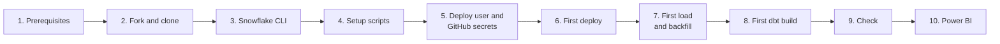

# Run your own copy

Step by step from a fork to a scheduled pipeline and a refreshing Power BI report, on your own Snowflake account and GitHub. How the parts fit together: [architecture.md](architecture.md).



## 1. Prerequisites and cost

| You need | Why | Cost |
|---|---|---|
| Snowflake account, **paid** (Standard edition is enough) | The loader calls the API from inside Snowflake (external access), which trial accounts block | See below |
| GitHub account | Fork, CI and deploys (GitHub Actions) | Free for public repos |
| Linux, macOS or WSL with [uv](https://docs.astral.sh/uv/), git, OpenSSL | Run tests, the Snowflake CLI and dbt locally | Free |
| Windows 10 or 11 with [Power BI Desktop](https://www.microsoft.com/power-bi/desktop) | Open and refresh the report | Free |
| Power BI Pro (or a Fabric capacity) | Only to publish the report to Power BI Service and share it | Per user licence |

**Snowflake cost, roughly.** Typical runs: load about 25 s on serverless SMALL compute, dbt about 70 s on the X-SMALL `TENDER_WH` (billed at least 60 s, then suspends after 60 s idle), 5 times a day. With a Power BI refresh after each build, expect around 10–15 credits a month; storage is a few GB. Check actual use in Snowsight → Admin → Cost management after the first week.

**Trial account?** External access is blocked, so the scheduled load can't run in Snowflake. You can still try everything else: run the loader from your computer (`uv run ingestion/load_find_a_tender.py`, step 7) and dbt locally against `dev` ([dbt.md](dbt.md)).

## 2. Fork and clone

1. Fork the repository on GitHub, then enable workflows in your fork: Actions tab → *I understand my workflows, go ahead and enable them*.
2. Clone and install:

   ```bash
   git clone https://github.com/<you>/uk-tenders-dbt-snowflake.git
   cd uk-tenders-dbt-snowflake
   uv sync                    # Python 3.14 and dependencies
   uv sync --group dbt        # dbt-core and dbt-snowflake 1.12
   uv run pre-commit install  # checks before every commit
   uv run pytest && uv run mypy
   ```

3. Point the loader's `USER_AGENT` (`ingestion/load_find_a_tender.py`) at your fork, so the API's operators can see who is calling.

## 3. Snowflake CLI and your key pair

Follow [snowflake-cli.md → Set up a computer](snowflake-cli.md#set-up-a-computer-once): install `snow`, create a key pair, register the public key on your Snowflake user and add a connection named `tender` with role `SYSADMIN`. Your user needs `ACCOUNTADMIN` for some scripts below.

```bash
snow connection test -c tender
```

## 4. Run the setup scripts

Two scripts grant roles to the author's user, `JACEKJ`; change that to your Snowflake user name first:

```bash
sed -i 's/TO USER JACEKJ/TO USER <YOUR_USER>/' snowflake/setup/03_transform_role.sql snowflake/setup/04_reporting_role.sql
```

Then run them in this order (each script switches to the role it needs):

```bash
snow sql -f snowflake/setup/01_database_warehouse.sql -c tender
snow sql -f snowflake/setup/02_raw_objects.sql -c tender
snow sql -f snowflake/setup/03_transform_role.sql -c tender
snow sql -f snowflake/setup/04_reporting_role.sql -c tender
snow sql -f snowflake/native_ingestion/00_code_stage.sql -c tender
snow sql -f snowflake/native_ingestion/01_external_access.sql -c tender
snow sql -f snowflake/dbt/00_dbt_setup.sql -c tender
```

| Script | Runs as | Creates |
|---|---|---|
| `setup/01_database_warehouse.sql` | SYSADMIN | Database `TENDER_DB`, schema `RAW`, warehouse `TENDER_WH` (X-SMALL, auto-suspend 60 s) |
| `setup/02_raw_objects.sql` | SYSADMIN | Raw tables `FIND_A_TENDER_RELEASES`, `FIND_A_TENDER_INGEST_RUNS` |
| `setup/03_transform_role.sql` | ACCOUNTADMIN | Role `TENDER_TRANSFORM` (dbt): reads `RAW`, creates its own schemas; schema `PROD` |
| `setup/04_reporting_role.sql` | ACCOUNTADMIN | Role `TENDER_REPORTER` (Power BI): reads `PROD_MARTS`, `DEV_MARTS` |
| `native_ingestion/00_code_stage.sql` | SYSADMIN | Stage `RAW.CODE_STAGE` for the loader's Python file |
| `native_ingestion/01_external_access.sql` | ACCOUNTADMIN | Network rule and integration for the API host, email integration `TENDER_EMAIL`, role `TENDER_INGEST`, service user `TENDER_DEPLOY` |
| `dbt/00_dbt_setup.sql` | ACCOUNTADMIN | Schema `DBT` for the dbt project object, task and alert; grants `TENDER_TRANSFORM` to `TENDER_DEPLOY` |

Roles and what each may touch: [architecture.md → Roles and access](architecture.md#12-roles-and-access).

## 5. Deploy user and GitHub secrets

GitHub Actions deploys as the service user `TENDER_DEPLOY`, which signs in with a key pair. Create one, register it and store the private key as a secret ([snowflake-cli.md → Deploy user](snowflake-cli.md#deploy-user-for-github-actions)):

```bash
openssl genrsa 2048 | openssl pkcs8 -topk8 -nocrypt -out deploy_key.p8
PUB=$(openssl rsa -in deploy_key.p8 -pubout | grep -v '^-----' | tr -d '\n')
snow sql -c tender -q "USE ROLE ACCOUNTADMIN; ALTER USER TENDER_DEPLOY SET RSA_PUBLIC_KEY = '$PUB'"

gh secret set SNOWFLAKE_ACCOUNT --body <orgname>-<accountname>
gh secret set SNOWFLAKE_USER --body TENDER_DEPLOY
gh secret set SNOWFLAKE_PRIVATE_KEY < deploy_key.p8
gh secret set ALERT_EMAIL --body <you@example.com>
rm deploy_key.p8
```

`ALERT_EMAIL` must be the **verified** email address of a user in your Snowflake account (Snowsight → your profile → verify email); Snowflake only emails verified addresses. Test it once:

```bash
snow sql -c tender -f snowflake/checks/alert_email.sql -D alert_email=<you@example.com>
```

## 6. First deploy

Run the Deploy workflow by hand; a manual run deploys everything (loader, procedures, ingest task and alert, dbt project, dbt task and alert):

```bash
gh workflow run deploy.yml --ref main
gh run watch
```

From now on, merging to `main` deploys only what changed, after the CI checks pass ([architecture.md → Change to production](architecture.md#6-swimlane-from-change-to-production)). The tasks are now scheduled: loads at 07:00, 10:00, 13:00, 16:00 and 19:00 UK time, dbt 20 minutes later.

## 7. First load and backfill

Run the first load now rather than waiting for the schedule, then check it:

```bash
snow sql -c tender -q "EXECUTE TASK TENDER_DB.RAW.INGEST_FIND_A_TENDER"
snow sql -c tender -f snowflake/checks/ingest_health.sql
```

That loads the last 3 hours. To load the history since the Procurement Act started (24 February 2025, about 2,000 API pages, roughly an hour), follow [snowflake-cli.md → Backfill history](snowflake-cli.md#backfill-history-once); it needs one successful scheduled load first. Check it with `snowflake/checks/backfill_coverage.sql`.

## 8. First dbt build

Build the prod schemas now rather than waiting for the next scheduled run:

```bash
snow sql -c tender -q "EXECUTE TASK TENDER_DB.DBT.RUN_DBT"
```

Watch it in Snowsight → Monitoring → dbt projects. For development, set up `~/.dbt/profiles.yml` and build into your `DEV_*` schemas from your computer ([dbt.md → Set up](dbt.md#set-up-once)).

## 9. Check

```bash
snow sql -c tender -q "SELECT name, state, error_message, query_start_time
  FROM TABLE(TENDER_DB.INFORMATION_SCHEMA.TASK_HISTORY())
  WHERE name IN ('INGEST_FIND_A_TENDER', 'RUN_DBT') AND state <> 'SCHEDULED'
  ORDER BY query_start_time DESC LIMIT 10"

snow sql -c tender -q "SELECT table_name, row_count
  FROM TENDER_DB.INFORMATION_SCHEMA.TABLES
  WHERE table_schema = 'PROD_MARTS' ORDER BY table_name"
```

Six mart tables with rows, and `SUCCEEDED` for both tasks, means the pipeline works end to end.

## 10. Power BI

Power BI signs in to Snowflake as its own user that holds only `TENDER_REPORTER`, so the report can read the marts and nothing else. It uses a key pair: the Power BI Snowflake connector supports key-pair sign-in for import models, Microsoft Entra SSO works only for DirectQuery, and password sign-in is being phased out ([Microsoft: Snowflake connector](https://learn.microsoft.com/power-query/connectors/snowflake)).

```bash
openssl genrsa 2048 | openssl pkcs8 -topk8 -nocrypt -out ~/.snowflake/powerbi_key.p8
chmod 600 ~/.snowflake/powerbi_key.p8
PUB=$(openssl rsa -in ~/.snowflake/powerbi_key.p8 -pubout | grep -v '^-----' | tr -d '\n')
snow sql -c tender -q "USE ROLE ACCOUNTADMIN;
  CREATE USER IF NOT EXISTS TENDER_POWERBI
    TYPE = SERVICE
    DEFAULT_ROLE = TENDER_REPORTER
    DEFAULT_WAREHOUSE = TENDER_WH
    DEFAULT_NAMESPACE = TENDER_DB.PROD_MARTS
    COMMENT = 'Power BI: reads the marts only';
  GRANT ROLE TENDER_REPORTER TO USER TENDER_POWERBI;
  ALTER USER TENDER_POWERBI SET RSA_PUBLIC_KEY = '$PUB'"
```

Then open the report, point it at your account, refresh it and (optionally) publish it with a scheduled refresh: see the Power BI guide, `docs/powerbi.md`, which ships with the report in `powerbi/`. Copy `powerbi_key.p8` to the Windows computer for Power BI Desktop; keep it out of the repository.

## Run it

| Task | How |
|---|---|
| See task runs and errors | `TASK_HISTORY` query in step 9, or Snowsight → Monitoring → Task history |
| See dbt output | Snowsight → Monitoring → dbt projects |
| Loader runs and windows | `snowflake/checks/ingest_health.sql` |
| A task suspended itself (3 failures in a row) | Fix the cause, then `ALTER TASK TENDER_DB.RAW.INGEST_FIND_A_TENDER RESUME` (or `TENDER_DB.DBT.RUN_DBT`); a redeploy also resumes it |
| Pause everything to save credits | `ALTER TASK TENDER_DB.RAW.INGEST_FIND_A_TENDER SUSPEND`, `ALTER TASK TENDER_DB.DBT.RUN_DBT SUSPEND`; the next deploy of those files resumes them |
| Upgrade dbt | Move the pins in `pyproject.toml` and `deploy.yml` together ([dbt.md → Runs in Snowflake](dbt.md#runs-in-snowflake)) |
| Change the schedule | Edit the cron in `03_ingest_task.sql` and `01_run_dbt_task.sql` (and the alerts), merge to `main` |

## Remove it

No need to suspend anything first: dropping the database drops its tasks, alerts, procedures and stage. Integrations go first because they refer to the network rule in `RAW`.

```bash
snow sql -c tender -q "USE ROLE ACCOUNTADMIN;
  DROP INTEGRATION IF EXISTS FIND_A_TENDER_API_ACCESS;
  DROP INTEGRATION IF EXISTS TENDER_EMAIL;
  DROP DATABASE IF EXISTS TENDER_DB;
  DROP WAREHOUSE IF EXISTS TENDER_WH;
  DROP USER IF EXISTS TENDER_DEPLOY;
  DROP USER IF EXISTS TENDER_POWERBI;
  DROP ROLE IF EXISTS TENDER_INGEST;
  DROP ROLE IF EXISTS TENDER_TRANSFORM;
  DROP ROLE IF EXISTS TENDER_REPORTER"
```

Then delete the GitHub secrets (`gh secret delete <name>`) and the published report, if any.
